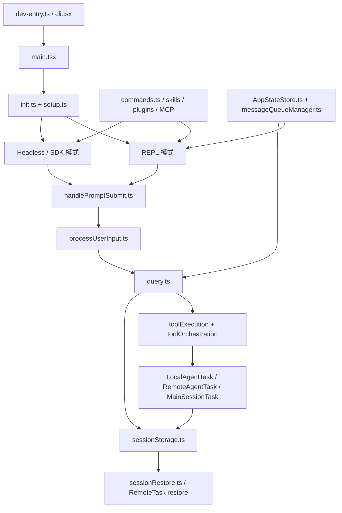

# Claude Code CLI 架构基线

> 目标：给后续开发提供统一心智模型，避免继续以“目录印象”驱动改动。
> 适用范围：`src/` 主运行时、会话系统、任务系统、扩展系统。

---

## 项目定位

这个仓库的本体不是“一个带很多命令的 CLI”，而是一个运行在终端里的 agent runtime。

CLI、TUI、headless、远程会话、subagent、MCP、skills、plugins，都是围绕同一条执行主链暴露出来的不同入口和能力层。

从开发角度，必须先接受下面三个事实：

1. **REPL 不是薄 UI**，而是运行时壳层。
2. **会话不是消息数组**，而是可恢复的运行状态。
3. **扩展不是附属功能**，而是命令、工具、资源、权限体系的正式输入源。

---

## 一张总图

---

## 核心子系统

| 子系统 | 作用 | 核心文件 |
|------|------|------|
| 启动与分流 | 启动 CLI、解析 fast-path、决定 REPL/headless/remote 分支 | `src/dev-entry.ts`、`src/entrypoints/cli.tsx`、`src/main.tsx` |
| 初始化与会话建立 | 建立 cwd/worktree/tmux/remote/settings/telemetry 基础环境 | `src/entrypoints/init.ts`、`src/setup.ts` |
| 输入与命令路由 | 处理用户输入、slash command、粘贴引用、hooks、队列命令 | `src/utils/handlePromptSubmit.ts`、`src/utils/processUserInput/processUserInput.ts`、`src/utils/messageQueueManager.ts` |
| 查询与工具执行 | 驱动模型回合、工具流式执行、并发调度、compact、fallback | `src/query.ts`、`src/services/tools/toolExecution.ts`、`src/services/tools/toolOrchestration.ts`、`src/services/tools/StreamingToolExecutor.ts` |
| 权限与交互控制 | 统一 allow/deny/ask 决策，协调 UI、bridge、hook、classifier | `src/utils/permissions/permissions.ts`、`src/hooks/useCanUseTool.tsx`、`src/hooks/toolPermission/PermissionContext.ts` |
| 任务与子代理 | 本地 agent、远程 agent、主会话后台化、任务输出和通知 | `src/tasks/LocalAgentTask/LocalAgentTask.tsx`、`src/tasks/RemoteAgentTask/RemoteAgentTask.tsx`、`src/tasks/LocalMainSessionTask.ts` |
| 持久化与恢复 | transcript、sidecar metadata、content replacement、resume/recover | `src/utils/sessionStorage.ts`、`src/utils/sessionRestore.ts` |
| 扩展装配 | 合并 commands、skills、plugins、workflow、MCP | `src/commands.ts`、`src/skills/loadSkillsDir.ts`、`src/utils/plugins/pluginLoader.ts`、`src/services/mcp/config.ts` |
| 交互壳层 | REPL 主界面、任务面板、远程恢复、队列消费、弹窗和状态 | `src/screens/REPL.tsx`、`src/components/App.tsx` |
| 运行态模型 | 统一托管几乎所有会话内状态 | `src/state/AppStateStore.ts`、`src/state/store.ts` |

---

## 主执行链

### 1. 启动分流

启动链路是：

`dev-entry.ts` -> `entrypoints/cli.tsx` -> `main.tsx` -> `init.ts` -> `setup.ts`

其中每一层的职责不同：

- `dev-entry.ts` 负责恢复仓库的安全启动和缺失导入检查。
- `entrypoints/cli.tsx` 负责 fast-path，例如 `--version`、bridge、daemon、remote runner。
- `main.tsx` 是真正的 CLI 总控，负责 Commander 命令树、`preAction` 初始化、REPL/headless 分流。
- `init.ts` 负责环境级初始化。
- `setup.ts` 负责会话级初始化。

结论：后续任何“新增 CLI 入口”或“改变启动行为”的开发，都应该先判断是属于 fast-path、全局 init，还是会话级 setup，不能一律堆进 `main.tsx`。

### 2. 输入进入查询前的处理

用户输入不会直接进入模型。

输入主链是：

`handlePromptSubmit.ts` -> `processUserInput.ts` -> `query.ts`

这条链会先做：

- 处理 queued commands
- 展开 pasted refs 和 image refs
- 识别并执行本地 slash command
- 执行输入 hooks
- 注入附加上下文
- 决定这次是否真的触发模型查询

结论：如果后续要开发新的“本地命令行为”“预处理规则”“输入注入能力”，优先放在 `handlePromptSubmit.ts` / `processUserInput.ts`，而不是直接改 `query.ts`。

### 3. 查询与工具执行

`src/query.ts` 是整个系统的核心执行器。

它负责：

- 准备 messages for query
- compact / microcompact / reactive compact
- 流式接收 assistant 输出
- 识别 tool_use
- 将工具执行委派给 `toolExecution.ts`
- 使用 `toolOrchestration.ts` 和 `StreamingToolExecutor.ts` 管理串并行与顺序回填
- 管理 stop reason、budget、fallback、重试

`toolExecution.ts` 才是实际的工具运行入口，它会：

- 查找工具
- 解析输入 schema
- 走权限检查
- 运行前后 hooks
- 记录 tool result
- 将结果转回消息块

结论：`query.ts` 是“回合控制器”，`toolExecution.ts` 是“单次工具调用控制器”。开发时不要把两者的职责混在一起。

---

## 权限与交互控制

权限系统不是一个简单的 `if allow else deny`。

核心分层如下：

- `src/utils/permissions/permissions.ts`
  负责规则合并与静态判定。
- `src/hooks/useCanUseTool.tsx`
  负责把静态判定转成运行时行为。
- `src/hooks/toolPermission/PermissionContext.ts`
  负责一次权限请求的上下文、日志、订阅、取消、决策落盘。
- `src/hooks/toolPermission/handlers/interactiveHandler.ts`
  负责与 REPL/bridge/channel/classifier 的竞争式交互。

这里的关键点是：

1. 权限请求是会话内异步实体。
2. 一个权限请求可能同时被多个来源响应。
3. 最终只允许一个 winner resolve。

结论：后续如果开发新权限模式、自动批准策略或 bridge 权限转发，必须从 `PermissionContext` 和 `interactiveHandler` 下手，不能只在单个 tool 内补判断。

---

## 任务系统与子代理系统

这个项目里的后台任务不是附属功能，而是运行时一级公民。

### 本地任务

`LocalAgentTask.tsx` 负责本地 agent 的生命周期：

- 注册任务
- 前台转后台
- 进度汇总
- transcript symlink
- 任务通知
- 终止与清理

`LocalMainSessionTask.ts` 则把“主会话查询后台化”也包装成任务，复用本地 agent 的大部分行为。

### 远程任务

`RemoteAgentTask.tsx` 负责 CCR 远程任务：

- 注册远程任务
- 持久化 remote metadata
- 轮询 session events
- 识别 remote review / ultraplan 的完成信号
- 恢复仍在运行的远程任务

### 为什么复杂

这里难点不在“启动一个后台任务”，而在：

- 任务结果要回流成消息
- 任务 transcript 要被查看
- 任务状态要能恢复
- 任务通知不能重复
- 前台/后台切换不能丢上下文

结论：后续开发子代理、多任务、任务面板时，不能把任务当成纯 UI 状态；它们本质上是可恢复会话分支。

---

## 持久化与恢复模型

`src/utils/sessionStorage.ts` 是整个系统最容易被低估、也最容易被改坏的文件之一。

它不只是保存 JSONL，而是在定义：

- 什么算 transcript message
- 什么只是 ephemeral progress
- sidechain transcript 怎么组织
- agent metadata / remote metadata 放哪
- content replacement 如何恢复
- queue-operation 如何记录

`src/utils/sessionRestore.ts` 则负责把这些持久化事实恢复为运行状态：

- session id
- mode
- worktree
- agent setting
- attribution
- todo state
- context collapse state
- 远程任务恢复

结论：后续任何涉及 `/resume`、`/continue`、后台任务、subagent transcript、消息格式变化的开发，都必须同时检查 `sessionStorage.ts` 与 `sessionRestore.ts`。

---

## 扩展系统：不是一套，而是三套

### 1. 命令扩展

`src/commands.ts` 统一装配：

- hardcoded commands
- bundled skills
- builtin plugin skills
- skills dir commands
- workflow commands
- plugin markdown commands
- plugin skills

它给用户一个统一的“命令面”。

### 2. 工具扩展

`src/Tool.ts` 定义工具协议，`src/tools.ts` 和 `src/hooks/useMergedTools.ts` 负责工具池装配、排序、过滤和 prompt-cache 稳定性。

它给模型一个统一的“工具面”。

### 3. MCP 扩展

MCP 是会话期动态装配：

- `config.ts` 读多来源配置并做内容签名级去重
- `client.ts` 负责连接与获取 tools/prompts/resources
- `useManageMCPConnections.ts` 负责热连接、重连、切换启停、`list_changed` 刷新

它给运行时一个统一的“外部能力面”。

### 4. Plugin 扩展

plugin 既可能提供 command，也可能提供 hook、MCP server、skill。

plugin 装配链是：

`pluginLoader.ts` -> `mcpPluginIntegration.ts` -> `commands.ts` / `config.ts`

结论：后续开发扩展功能时，必须先判断新增能力属于“命令”“工具”“MCP server”“plugin component”哪一种；这几种接入点完全不同。

---

## REPL 的真实角色

`src/screens/REPL.tsx` 不是简单把消息渲染出来。

它同时承担：

- command queue 消费
- 任务恢复
- 远程恢复
- 权限对话
- tool JSX
- 任务前台/后台切换
- IDE / inbox / mailbox / proactive / scheduled tasks
- 读文件状态恢复

这意味着 REPL 在架构上更像一个终端工作台，而不是一个聊天窗口。

结论：后续如果做 UI 改造，必须把 REPL 当成 orchestrator shell，而不是单纯的 view component。

---

## 后续开发的高风险文件

| 文件 | 风险原因 |
|------|------|
| `src/main.tsx` | 启动分流、初始化和模式切换高度集中，副作用多 |
| `src/screens/REPL.tsx` | UI、任务、队列、恢复、权限全部交汇 |
| `src/query.ts` | 回合控制、compact、streaming、fallback 都在这里 |
| `src/utils/sessionStorage.ts` | transcript 语义、恢复兼容性、sidecar 结构都在这里 |
| `src/services/mcp/useManageMCPConnections.ts` | 热连接、重连、增量刷新、插件变更都在这里 |
| `src/commands.ts` | 多来源命令合流点，容易出现重复/顺序/可见性问题 |
| `src/state/AppStateStore.ts` | 运行态字段多，任何状态模型变更都有级联影响 |

---

## 开发切入策略

### 如果你要改启动与模式

先读：

- `src/entrypoints/cli.tsx`
- `src/main.tsx`
- `src/setup.ts`

### 如果你要改输入和 slash command

先读：

- `src/utils/handlePromptSubmit.ts`
- `src/utils/processUserInput/processUserInput.ts`
- `src/commands.ts`

### 如果你要改工具和权限

先读：

- `src/Tool.ts`
- `src/services/tools/toolExecution.ts`
- `src/utils/permissions/permissions.ts`
- `src/hooks/useCanUseTool.tsx`

### 如果你要改 subagent / background task / remote task

先读：

- `src/tasks/LocalAgentTask/LocalAgentTask.tsx`
- `src/tasks/RemoteAgentTask/RemoteAgentTask.tsx`
- `src/tasks/LocalMainSessionTask.ts`
- `src/utils/task/framework.ts`

### 如果你要改 resume / continue / transcript

先读：

- `src/utils/sessionStorage.ts`
- `src/utils/sessionRestore.ts`
- `src/main.tsx`
- `src/screens/REPL.tsx`

### 如果你要改插件 / skills / MCP

先读：

- `src/commands.ts`
- `src/skills/loadSkillsDir.ts`
- `src/utils/plugins/pluginLoader.ts`
- `src/utils/plugins/mcpPluginIntegration.ts`
- `src/services/mcp/config.ts`
- `src/services/mcp/client.ts`

---

## 建议阅读顺序

建议不要按目录平铺，而按下面顺序进入：

1. `src/main.tsx`
2. `src/setup.ts`
3. `src/screens/REPL.tsx`
4. `src/utils/handlePromptSubmit.ts`
5. `src/utils/processUserInput/processUserInput.ts`
6. `src/query.ts`
7. `src/services/tools/toolExecution.ts`
8. `src/tasks/LocalAgentTask/LocalAgentTask.tsx`
9. `src/tasks/RemoteAgentTask/RemoteAgentTask.tsx`
10. `src/utils/sessionStorage.ts`
11. `src/utils/sessionRestore.ts`
12. `src/commands.ts`
13. `src/services/mcp/config.ts`
14. `src/services/mcp/useManageMCPConnections.ts`

---

## 当前开发前提

这份文档建立在静态源码深读之上，适合作为开发前的系统地图。

在真正进入功能开发前，还需要补三类运行时验证：

1. 启动验证：`bun run version`、`bun run dev`
2. 会话验证：新会话、`--continue`、`--resume`
3. 扩展验证：MCP 连接、plugin 装配、task/agent 恢复

如果没有这三类验证，后续改动仍然容易只在“代码结构上看起来正确”，但在真实运行链里出错。
